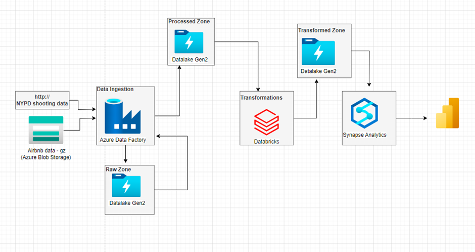

# 1-	Introduction
This project outlines a comprehensive data engineering pipeline utilizing various Azure services. We'll leverage Azure Data Factory to automate data retrieval, store it securely in Azure Data Lake Gen2, perform transformations using Azure Databricks, build data models in Azure Synapse Analytics, and finally create interactive visualizations with Power BI.
Following are the components and steps involved in this project:
## Data Ingestion (Azure Data Factory):
Azure Data Factory serves as our data ingestion platform. It enables us to collect Airbnb data and NYPD shooting list from various sources. Data Factory’s data connectors and scheduling capabilities are invaluable for automated ingestion.
## Data Storage (Azure Data Lake Gen2):
Processed Airbnb and NYPD shootings data is processed and saved in Azure Data Lake Gen2. This storage solution provides scalable, secure, and cost-effective storage, which is critical for accommodating the increasing volume of epidemic data.
## Data Transformation (Azure Databricks):
We utilize Azure Databricks for data transformation and processing tasks. Databricks clusters allow us to perform data cleansing, normalization, and feature engineering, preparing the Airbnb and NYPD shootings incidents data.
## Data Modeling (Azure Synapse):
Azure Synapse serves as our data modeling and analytics platform. We employ it to build data models, perform SQL-based queries, and conduct complex analytical tasks on the above-mentioned dataset.
## Data Visualization (Power BI):
Power BI is the tool of choice for data visualization. We create interactive dashboards and reports to present the Airbnb and shooting incidents data insights, enabling stakeholders to make informed decisions.
By orchestrating data flow, transformation, storage, modeling, and visualization using Azure services, we aim to provide actionable insights from this critical dataset.

# Architecture

The following steps were used to build the end-to-end pipeline:
## Step 1: Creating a Resource Group 
- Created Resource Group name - airbnb-safety-reporting-adf

## Step 2: Creating Azure Storage account.
- Created Storage account name -airbnbsafetysa

## Step 3: Download Azure storage explorer.

## Step 4: Creating Azure Lake storage Gen2
- Used as Datalake for data analysis
- Airbnb data - airbnbsafetydl
- Enable hirerarchial namespace in Advanced tab

### Azure Data Factory:
## Step 6: Data Ingestion pipeline – pl_ingest_listings_data – Ingestion of Airbnb data from Azure blob storage to Data Lake
### Copy activity-Azure blob storage to Data Lake
  ### Source
  -	Storage account - airbnbsafetysa
  -	Container-airbnblisting
  -	File-listings.csv.gz
  ### Sink
  - Storage account-airbnbsafetydl
  - Container-raw
  - File: airbnb/listings.csv
    
The above pipeline copy activity consists of following steps:
1. Lined service - source - ls_ablob_airbnbsafetysa
2. Source dataset -ds_listings_raw_gz
3. Linked service -sink - ls_adls_airbnbsafetydl
4. Sink dataset - ds_listings_raw_csv
5. Pipeline-pl_ingest_listings_data
6. Copyactivity - Copy Airbnb listings data

